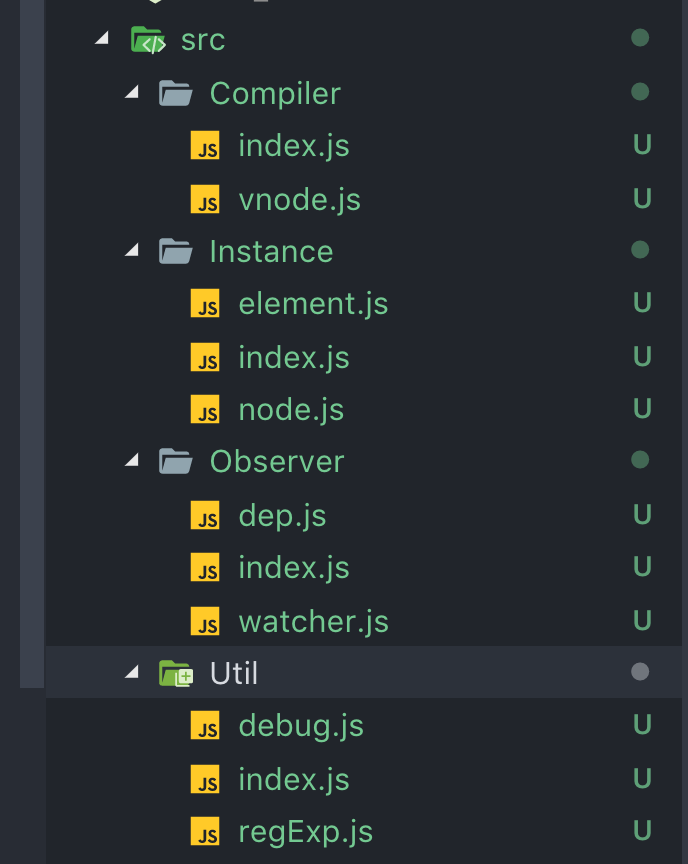
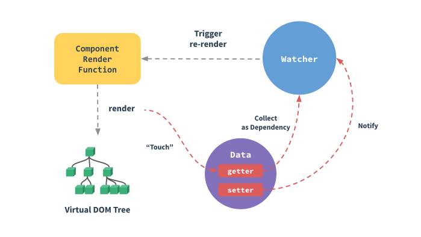
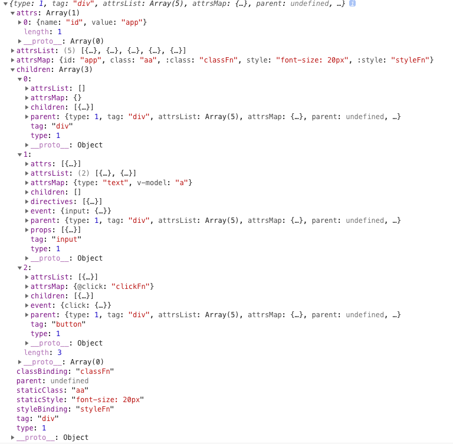

# miniVue

mini 版本 Vue,实现了 Vue 最核心部分代码,该项目是为了对 Vue 有更加深入了解,根据对源码剖析和自己的理解模拟 Vue 写的 mini 版本的 Vue

### 实例

```html
<!-- 如果使用MiniVue.min.js在实例化用new MiniVue.min进行实例化- -->
<!-- 如果使用MiniVue.es5.js在实例化用new MiniVue.es5进行实例化- -->
<script src="../dist/MiniVue.js"></script>
<div id="app" class="aa" :class="classFn" style="font-size: 20px" :style="styleFn">
  <div>{{a}}</div>
  <input type="text" v-model="a" /> <button @click="clickFn">xx</button>
</div>
```

```javascript
new MiniVue({
  el: '#app',
  data() {
    return {
      a: 1,
      color: '#999',
      classFn: 'bb'
    };
  },
  computed: {
    styleFn() {
      return { color: this.color };
    }
  },
  methods: {
    clickFn() {
      console.log('clickFn');
      this.a = this.a === 33333 ? 2222 : 33333;
      this.color = this.color === 'red' ? '#000' : 'red';
    }
  },
  created() {
    console.log('created');
  },
  beforeMount() {
    console.log('beforeMount');
  },
  beforeUpdate() {
    console.log('beforeUpdate');
  },
  mounted() {
    console.log('mounted');
    setTimeout(() => {
      this.a = 2222;
    }, 1000 * 3);
  }
});
```

### 文件目录



Comilper--->  主要是处理 dom 编译

Instance--->  程序入口和创建 dom

Observer---> 数据拦截 ，数据订阅，发布，更新

Util--->  程序工具类(debug,nextTick...)

### 深入响应式原理

先看一张`Vue` 官方文档中的图



当你把一个普通的 JavaScript 对象传给 Vue 实例的 data 选项，Vue 将遍历此对象所有的属性，并使用 Object.defineProperty 把这些属性全部转为 getter/setter。Object.defineProperty 是 ES5 中一个无法 shim 的特性，这也就是为什么 Vue 不支持 IE8 以及更低版本浏览器。

这些 getter/setter 对用户来说是不可见的，但是在内部它们让 Vue 追踪依赖，在属性被访问和修改时通知变化。这里需要注意的问题是浏览器控制台在打印数据对象时 getter/setter 的格式化并不同，所以你可能需要安装 vue-devtools 来获取更加友好的检查接口。

每个组件实例都有相应的 watcher 实例对象，它会在组件渲染的过程中把属性记录为依赖，之后当依赖项的 setter 被调用时，会通知 watcher 重新计算，从而致使它关联的组件得以更新

### MiniVue  响应式原理

MiniVue 是对 Vue 进行  深度学习得等的  产品,大部分代码都是来源 Vue 源码， 在 MiniVue 中使用了`Object.defineProperty()`进行数据劫持,来监听`setter`和`getter`

- 数据初始化劫持

```javascript
 /**
   * 初始化data对象数据,收集数据添加监听
   */
  _initData() {
    let vm = this;
    let data = this.$options.data;
    // data支持两种写法(函数和对象)
    // 如果data是函数就直接执行拿到返回值,如果是对象直接返回
    data = vm._data = typeof data === 'function' ? data.call(vm) : data || {};

    const keys = Object.keys(data);
    let i = keys.length;
    while (i--) {
      let key = keys[i];
      this.proxy(vm, '_data', key);
    }
    observe(data, vm);
  }
```

- 核心代码

```javascript
Object.defineProperty(obj, key, {
  // 可枚举
  enumerable: true,
  configurable: true,
  get: function reactiveGetter() {
    const value = getter ? getter.call(obj) : val;
    // 依赖收集
    if (Dep.target) {
      dep.depend();
    }
    return value;
  },
  set: function reactiveSetter(newVal) {
    const value = getter ? getter.call(obj) : val;
    if (newVal === value || (newVal !== newVal && value !== value)) {
      return;
    }
    // 更新值
    if (setter) {
      setter.call(obj, newVal);
    } else {
      val = newVal;
    }
    // 新的值是object的话，进行监听
    childObj = observe(newVal);
    // 通知所有订阅者进行视图更新
    dep.notify();
  }
});
```

 这样我们已经可以监听每个数据的变化了，那么监听到变化之后就通知订阅者，所以接下来我们需要实现一个消息订阅器，维护一个数组，用来收集订阅者，数据变动触发`notify`，再调用订阅者的`update`方法

```javascript
/**
 * 订阅者Dep
 * 主要作用是用来存放Watcher观察者对象
 */
export default class Dep {
  constructor() {
    // 标示id防止添加重复观察者对象
    this.id = uid++;
    // 存储观察者对象
    this.subs = [];
  }
  /**
   * 添加观察者
   * @param {Watcher对象} sub
   */
  addSub(sub) {
    this.subs.push(sub);
  }
  /**
   * 通知所有订阅者
   * update方法是挂载在Watcher原型对象上面的,方法内部会把需要的更新数据push到异步队列中,等到数据所有操作完成在进行视图更新
   */
  notify() {
    // 拷贝观察者对象
    const subs = this.subs.slice();
    // 循环所有观察者进行更新操作
    subs.map(item => {
      item.update();
      return item;
    });
  }
}
```

总结: 响应式原理 ---> 初始化会获取`data`里面的数据，进行数据劫持使用`Object.defineProperty`进行数据劫持, 对`data`里面的每一条数据进行`setter`和`getter`,当有获取数据触发`getter`进行依赖收集,当有数据发生改变触发`setter`更新数据， 并且通知订阅者触发更新

### MiniVue AST

内部通过  遍历 html 文档树，通过正则匹配转换成`AST`树

```javascript
/**
   * html转为Ast
   * @returns Object AST语法树
   */
  _convertHtml2Ast() {
    while (this.template) {
      let textEnd = this.template.indexOf('<');

      if (textEnd === 0) {
        // 如果是注释标签直接跳过编译
        if (regExp.comment.test(this.template)) {
          let commentEnd = this.template.indexOf('-->');
          this._advance(commentEnd + 3);
          continue;
        }

        // 匹配结束标签
        let endTagMatch = this.template.match(regExp.endTag);
        if (endTagMatch) {
          let _index = this.index;
          this._advance(endTagMatch[0].length);
          this._parseEndTag(endTagMatch[1], _index, this.index);
          continue;
        }

        // 匹配开始标签
        let startTagMatch = this._parseStartTag();
        if (startTagMatch) {
          this._handleStartTag(startTagMatch);
          continue;
        }
      }
    }
  }
```

```javascript
for (var i = 0, l = attrs.length; i < l; i++) {
  map[attrs[i].name] = attrs[i].value;
  /**
   * 1.匹配 @ 符号表示是绑定事件
   * 2.匹配 :class :style 表达式class和表达式style
   * 3.匹配 class style 静态class和静态style
   * 4.普通数据(如: id)
   */
  if (attrs[i].name.match(/^@/g)) {
    isEvent = true;
    event[attrs[i].name.match(/\w*$/)[0]] = { value: attrs[i].value };
  } else if (class2styleReg.test(attrs[i].name)) {
    attrs[i].name.indexOf('class') > -1 ? (staticClass = attrs[i].value) : (staticStyle = attrs[i].value);
  } else if (class2styleExpReg.test(attrs[i].name)) {
    attrs[i].name.indexOf(':class') > -1 ? (classBinding = attrs[i].value) : (styleBinding = attrs[i].value);
  } else if (attrs[i].name === 'v-model') {
    isEvent = true;
    event['input'] = { value: `function($event){if($event.target.composing)return;${attrs[i].value}=$event.target.value}` };

    props.push({
      name: 'value',
      value: `(${attrs[i].value})`
    });

    directives.push({
      arg: null,
      modifiers: undefined,
      name: 'model',
      rawName: 'v-model',
      value: attrs[i].value
    });
  } else {
    _attrs.push({
      name: attrs[i].name,
      value: attrs[i].value
    });
  }
}
// 默认根ast数据结构
var astMap = {
  type: 1,
  tag: startTagMatch.tagName,
  attrsList: attrs,
  attrsMap: map,
  parent: parent,
  children: []
};
```

通过正则匹配把 Html 转为为 AST 树

 结构如下:



### MiniVue VNode

VNode( 虚拟 Dom)
可以把真实 DOM 树抽象成一棵以 JavaScript 对象构成的抽象树，在修改抽象树数据后将抽象树转化成真实 DOM 重绘到页面上呢？于是虚拟 DOM 出现了，它是真实 DOM 的一层抽象，用属性描述真实 DOM 的各个特性。当它发生变化的时候，就会去修改视图。

可以想象，最简单粗暴的方法就是将整个 DOM 结构用 innerHTML 修改到页面上，但是这样进行重绘整个视图层是相当消耗性能的，我们是不是可以每次只更新它的修改呢？所以 Vue.js 将 DOM 抽象成一个以 JavaScript 对象为节点的虚拟 DOM 树，以 VNode 节点模拟真实 DOM，可以对这颗抽象树进行创建节点、删除节点以及修改节点等操作，在这过程中都不需要操作真实 DOM，只需要操作 JavaScript 对象后只对差异修改，相对于整块的 innerHTML 的粗暴式修改，大大提升了性能。修改以后经过 diff 算法得出一些需要修改的最小单位，再将这些小单位的视图进行更新。这样做减少了很多不需要的 DOM 操作，大大提高了性能。

Vue 就使用了这样的抽象节点 VNode，它是对真实 DOM 的一层抽象，而不依赖某个平台，它可以是浏览器平台，也可以是 weex，甚至是 node 平台也可以对这样一棵抽象 DOM 树进行创建删除修改等操作，这也为前后端同构提供了可能

```javascript
export default class VNode {
  constructor(tag, data, children, text, elm, context, componentOptions, asyncFactory) {
    /*当前节点的标签名*/
    this.tag = tag;
    /*当前节点对应的对象，包含了具体的一些数据信息，是一个VNodeData类型，可以参考VNodeData类型中的数据信息*/
    this.data = data;
    /*当前节点的子节点，是一个数组*/
    this.children = children;
    /*当前节点的文本*/
    this.text = text;
    /*当前虚拟节点对应的真实dom节点*/
    this.elm = elm;
    /*当前节点的名字空间*/
    this.ns = undefined;
    /*编译作用域*/
    this.context = context;
    /*函数化组件作用域*/
    this.functionalContext = undefined;
    /*节点的key属性，被当作节点的标志，用以优化*/
    this.key = data && data.key;
    /*组件的option选项*/
    this.componentOptions = componentOptions;
    /*当前节点对应的组件的实例*/
    this.componentInstance = undefined;
    /*当前节点的父节点*/
    this.parent = undefined;
    /*简而言之就是是否为原生HTML或只是普通文本，innerHTML的时候为true，textContent的时候为false*/
    this.raw = false;
    /*静态节点标志*/
    this.isStatic = false;
    /*是否作为跟节点插入*/
    this.isRootInsert = true;
    /*是否为注释节点*/
    this.isComment = false;
    /*是否为克隆节点*/
    this.isCloned = false;
    /*是否有v-once指令*/
    this.isOnce = false;
  }
  child() {
    return this.componentInstance;
  }
}
```

会根据生成的`AST`树转换成 render 函数，render 函数创建每个节点 VNode

- render 函数

```javascript
"with(this){return _c('div',{staticClass:"aa bb",class:classFn,staticStyle:{"width":"200px","height":"50px"},style:(styleFn),attrs:{"id":"app"}},[_c('input',{directives:[{name:"model",rawName:"v-model",value:(testData),expression:"testData"}],attrs:{"type":"text","name":""},domProps:{"value":(testData)},on:{"input":function($event){if($event.target.composing)return;testData=$event.target.value}}}),_v(" "),_c('button',{on:{"click":update}},[_v("update")])])}
```

\_c ---> 创建标签
\_v ---> 创建文本节点
\_s --->  字符串序列化

\_c:

```javascript
/**
 * 创建元素
 * @param {Object} context miniVue实例
 * @param {String} tag 标签
 * @param {Object} data 数据
 * @param {Array} children 子节点
 */
export function createElement(context, tag, data, children) {
  var vnode;

  if (!tag) {
    createEmptyVNode();
  }
  // 兼容不传data的情况, 处理<span>{{a}}</span>这种dom情况,字符串function为: _c('span', [_v(_s(a))])
  if (Array.isArray(data)) {
    children = data;
    data = undefined;
  }

  if (typeof tag === 'string') {
    vnode = new VNode(tag, data, children, undefined, undefined, context);
  }

  if (vnode !== undefined) {
    return vnode;
  }
}
```

\_v:

```javascript
/**
 * 创建文本节点
 */
export function createTextVNode(val) {
  return new VNode(undefined, undefined, undefined, String(val));
}
```

### 最后


